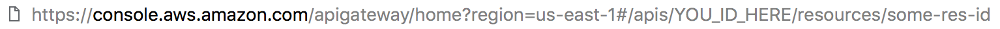
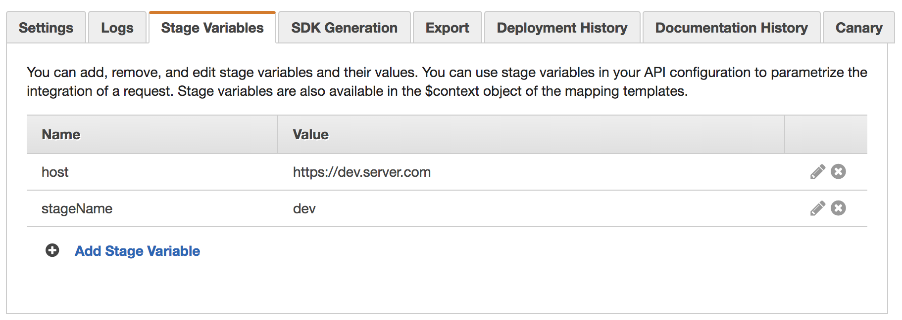
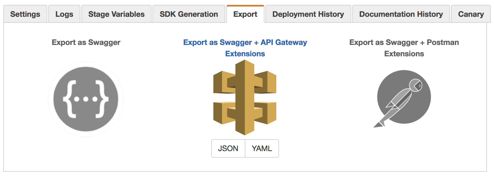

# aws-apigateway-manager

## Instalation
```sh
npm i aws-apigateway-manager
```
## Usage
 - `-r`, `--region` (required) - region to deploy
 - `-s`, `--stage` (required) - stage to deploy (ex: dev, prod)
 - `--accessKeyId` - from AWS credentials
 - `--secretAccessKey` - from AWS credentials

## Configuration

The tool allows you to use [credential](https://docs.aws.amazon.com/sdk-for-javascript/v2/developer-guide/getting-started-nodejs.html#getting-started-nodejs-credentials) file or pass credentials
through options during run the tool.

### Project structure
```
project
├── aws-apigateway
│   ├── stages.json
│   └── swagger.json
└── package.json
```

#### stages.json
This file describes stages and **API ID**.
```json
{
  "restApiId": "xxxxxxxxxx",
  "dev": {}
}
```
You can grab `restApiId` from the adress bar.


Also it's possible to pass stage viraables.
```json
{
  "restApiId": "xxxxxxxxxx",
  "dev": {
      "stageName": "dev",
      "host": "https://dev.server.com"
  },
  "production": {
      "stageName": "prod",
      "host": "https://server.com"
  }
}
```
The result will be like that:


#### swagger.json
The JSON Swagger file that was grabbed from API Gateawy via export:


What you have to know if you are using custom lambda authorizers.
Each lambda with alias have to be permited. And the tool allows
you to do it.

The tool rely you are using lambdas with aliases and generate arn to grant access so:
```
arn:aws:lambda:${region}:${accountId}:function:${lambdaName}:${stage}
```

Your `securityDefinitions` should looks like that:
Pay attention to `dev` alias.
```json
"securityDefinitions": {
    "auth1": {
      "x-amazon-apigateway-authorizer": {
        "authorizerUri": "arn:aws:apigateway:west-1:lambda:path/functions/arn:aws:lambda:west-1:accountId:function:lambda-function-name:dev/invocations",
      }
    },
    "auth2": {
    },
  },

```
Or you can use `stageVariables`:
```json
"x-amazon-apigateway-authorizer": {
  "authorizerUri": "arn:aws:apigateway:west-1:lambda:path/functions/arn:aws:lambda:west-1:accountId:function:lambda-function-name:${stageVariables.stageName}/invocations",
}
```

##### Placeholders
Also the tool can substitute placeholders.
You can use it, for instance in `authorizerUri`.

Placeholders:
 - `{{region}}` region which was passed via CLI
```json
"x-amazon-apigateway-authorizer": {
  "authorizerUri": "arn:aws:apigateway:{{region}}:lambda:path/functions/arn:aws:lambda:{{region}}:accountId:function:lambda-function-name:${stageVariables.stageName}/invocations",
}
```
